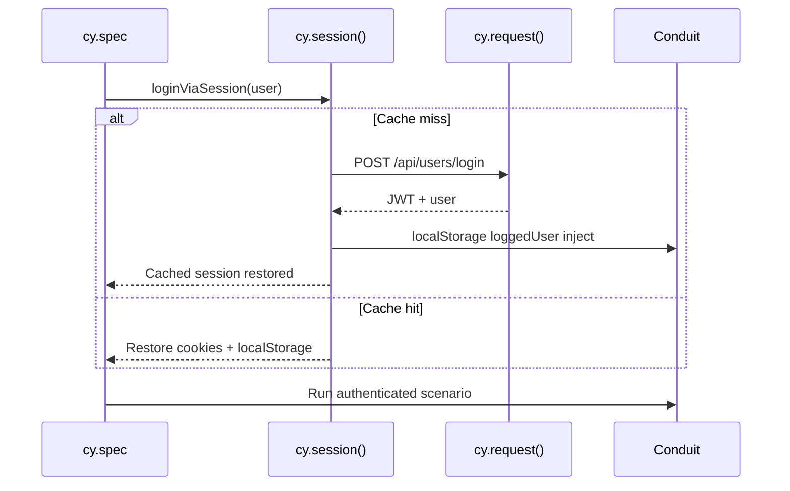
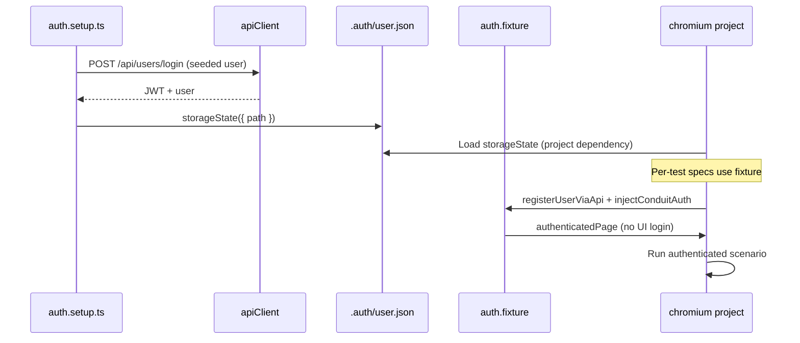

# Auth Flow Comparison: `cy.session()` vs Playwright `storageState` + API Login

> **Status:** Implemented and compared at pattern level; auth timing not separately instrumented.  
> **Decision reference:** [ADR-001: Why Playwright](../adr/001-why-playwright.md)  
> **Suite reliability data:** 10-run local baseline — both frameworks 100% pass rate, 0 flaky specs

## Overview

Authentication is the highest-frequency setup step in the P0 Conduit suite. Cypress caches auth with `cy.session()`; Playwright uses a **setup project** that persists `storageState` plus an **auth fixture** for per-test API login — mirroring Cypress's per-user isolation without repeating UI login.

## Pattern Summary

| Aspect | Cypress `cy.session()` | Playwright `storageState` + API login |
|--------|------------------------|---------------------------------------|
| Mechanism | Cache cookies/localStorage in memory between tests | Serialize browser state to `.auth/user.json` (setup) + `addInitScript` injection (fixture) |
| Setup location | `cypress/utils/auth.js` — `cy.loginViaSession(user)` | `auth.setup.ts` (setup project) + `fixtures/auth.fixture.ts` |
| API login | `POST /api/users/login` inside session callback | `POST /api/users/login` (setup) / `POST /api/users` + inject (fixture) |
| UI login specs | `register.cy.js`, `login.cy.js` — UI only | `register.spec.ts`, `login.spec.ts` — UI only |
| Per-test unique user | `buildUser()` + `registerUserViaApi` + `cy.session()` | `buildUser()` + `registerUserViaApi` + `injectConduitAuth` via fixture |
| Cross-spec reuse | Session cache keyed by email | Setup `storageState` for seeded user; fixture clears state for isolated specs |
| Parallel workers | Session cache per browser | Setup runs once; `chromium` project loads `storageState`; fixture overrides with empty state |
| Artifact on disk | None (in-memory) | `playwright/.auth/user.json` (gitignored) |
| Invalidation | New `cy.session()` key or cache clear | Re-run setup project; fixture calls `storageState: { cookies: [], origins: [] }` |

## Flow Diagrams

### Cypress — `cy.session()` + API login

### Playwright — setup project + `storageState` + auth fixture

## Measured Suite Data (auth overhead not isolated)

Auth-specific cold/warm timings were **not instrumented**. The table below uses **suite-level** numbers from the 10-run local baseline (includes auth setup as part of total runtime).

| Metric | Cypress | Playwright | Notes |
|--------|---------|------------|-------|
| Avg suite duration (10 runs) | 28.7s | 7.3s | Includes all auth setup paths |
| Pass rate (10 runs) | 100% | 100% | 9 P0 specs per run |
| Flaky specs (10 runs) | none | none | No auth-related intermittent failures observed |
| First auth (cold) | TODO: not measured | TODO: not measured | Requires dedicated instrumentation |
| Subsequent auth (warm) | TODO: not measured | TODO: not measured | Requires dedicated instrumentation |
| Auth per full suite (4 workers) | TODO: not measured | TODO: not measured | Baseline used default Playwright workers |
| Flaky auth failures (30 runs) | TODO: pending CI window | TODO: pending CI window | Local 10-run: 0 |

**Source:** `migration/baseline/cypress/baseline-summary.json`, `migration/baseline/playwright/baseline-summary.json`

## Observed Differences (implementation — not timed)

1. **Setup project overhead (Playwright only)** — One additional test (`auth.setup.ts`) runs before the `chromium` project; persists seeded-user `storageState` to `.auth/user.json`.
2. **Per-test isolation pattern is equivalent** — Both frameworks register a unique user via API for authenticated specs; neither repeats UI login except in register/login specs.
3. **Fixture overrides seeded storageState** — Playwright `auth.fixture.ts` sets `storageState: { cookies: [], origins: [] }` so per-test API auth does not inherit the seeded user from setup (avoids wrong-user assertions).
4. **Social specs** — Both use two API-registered users (author/target + reader/follower) with explicit login as the acting user.
5. **JWT storage format is identical** — `localStorage.loggedUser` JSON with `headers.Authorization: Token <jwt>` in both frameworks.
6. **Disk vs memory** — Playwright writes ephemeral `storageState` to gitignored `.auth/`; Cypress keeps session cache in-browser only.

## Trade-off Analysis

| Criterion | Observation | Rationale |
|-----------|-------------|-----------|
| Parallel suite duration | Playwright faster in measured baseline (−21.4s avg) | 4 workers + setup-once pattern; not auth-isolated |
| Simplicity for small suites | Cypress — fewer moving parts | No setup project or storage file |
| Explicit dependency graph | Playwright | `dependencies: ['setup']` visible in `playwright.config.ts` |
| Per-test user isolation | Tie | Both use API register + cached/injected auth |
| Token refresh / validation | Cypress — built-in `validate` callback | Playwright relies on re-run setup or fixture re-inject |
| CI artifact surface | Playwright — `.auth/user.json` ephemeral | Gitignored; not committed |

## Recommendation

**Adopt Playwright's setup-project + `storageState` + auth fixture as the target pattern**, with these guardrails:

- Keep **register/login as UI-only** specs in a separate unauthenticated project (`chromium-unauth`).
- Use **auth.fixture** for per-test unique users (parity with `cy.session()` isolation).
- **Do not** rely on seeded `storageState` alone for specs that need isolated users — fixture must clear state first.
- **TODO:** Instrument auth cold/warm timings in CI to validate overhead at scale.

## Implementation Checklist

- [x] Cypress: `utils/auth.js` with `cy.session()` + API login
- [x] Playwright: `auth.setup.ts` setup project
- [x] Playwright: `fixtures/auth.fixture.ts` for per-test authenticated page
- [x] Playwright: `utils/auth.ts` API login + JWT injection
- [x] Ensure `.auth/` and JWT files are gitignored
- [ ] Measure and populate auth timing table (cold/warm, per-worker)
