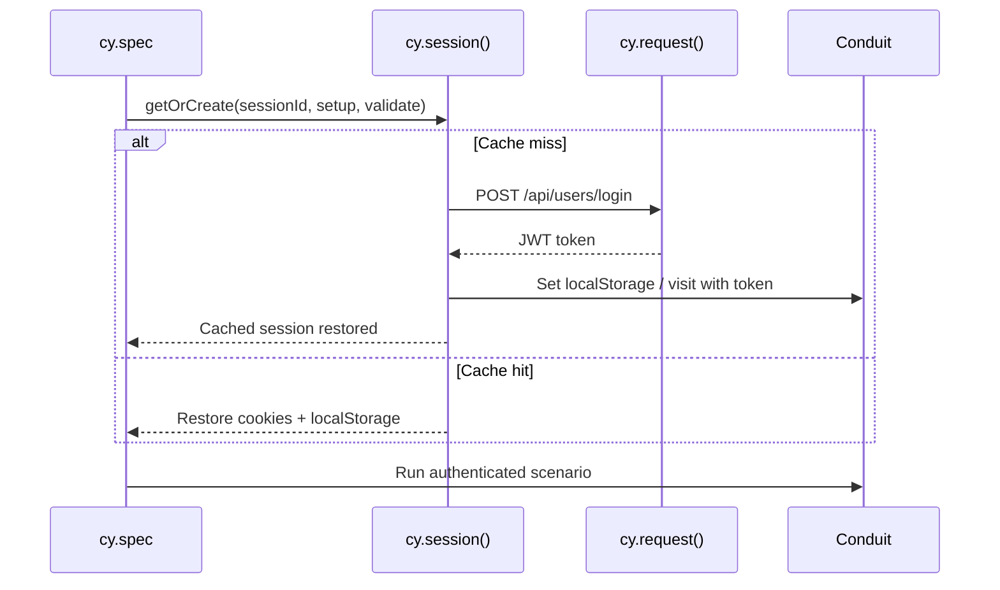
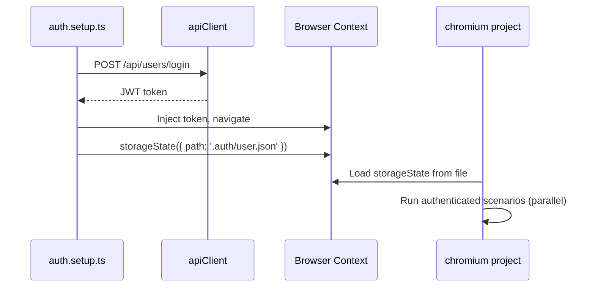

# Auth Flow Comparison: `cy.session()` vs Playwright `storageState`

> **Status:** Scaffold — populate with measured timings after implementation.
> **Decision reference:** [ADR-001: Why Playwright](../adr/001-why-playwright.md)

## Overview

Authentication is the highest-frequency setup step in the Conduit test suite. Both frameworks offer mechanisms to authenticate once and reuse state — but with different ergonomics, guarantees, and CI implications.

## Pattern Summary

| Aspect | Cypress `cy.session()` | Playwright `storageState` |
|--------|------------------------|---------------------------|
| Mechanism | Cache cookies/localStorage in memory between tests | Serialize browser state to JSON file |
| Setup location | `beforeEach` or custom command | Dedicated `setup` project (`auth.setup.ts`) |
| API login support | Yes — via `cy.request()` inside session callback | Yes — via API fixture, then `storageState({ path })` |
| Cross-spec reuse | Per spec file (configurable) | Across all projects via `dependencies` |
| Parallel workers | Session cache is per-browser, not cross-worker | Each worker can load same `.auth/user.json` |
| Invalidation | `cy.session()` cache key / `validate` callback | Re-run setup project or delete auth file |
| Artifact in CI | In-memory (no file) | `.auth/user.json` (gitignored, ephemeral in CI) |

## Flow Diagrams

### Cypress — `cy.session()` + API login

### Playwright — setup project + `storageState`

## Measured Comparison (placeholder)

| Metric | Cypress `cy.session()` | Playwright `storageState` | Notes |
|--------|------------------------|---------------------------|-------|
| First auth (cold) | _TBD ms_ | _TBD ms_ | API login path |
| Subsequent auth (warm) | _TBD ms_ | _TBD ms_ | Per spec / per worker |
| Auth per full suite (10 specs) | _TBD s_ | _TBD s_ | CI, 1 worker |
| Auth per full suite (10 specs) | _TBD s_ | _TBD s_ | CI, 4 workers |
| Flaky auth failures (30 runs) | _TBD_ | _TBD_ | Count |

## Trade-off Analysis

| Criterion | Winner | Rationale |
|-----------|--------|-----------|
| Parallel CI efficiency | Playwright | Setup project runs once; all workers share state file |
| Simplicity for small suites | Cypress | `cy.session()` inline, no project config |
| Cross-browser auth reuse | Playwright | Same `storageState` file across browser projects |
| Debugging auth failures | Tie | Cypress time-travel vs Playwright trace viewer |
| Token refresh / validation | Cypress | Built-in `validate` callback on session | 
| Explicit dependency graph | Playwright | `dependencies: ['setup']` is visible in config |

## Recommendation

Playwright's setup-project + `storageState` pattern is the preferred target state for this migration. It decouples authentication from individual tests, scales cleanly under parallel CI workers, and produces a reusable auth fixture — a deciding factor documented in ADR-001.

## Implementation Checklist

- [ ] Cypress: `utils/auth.js` with `cy.session()` + API login
- [ ] Playwright: `auth.setup.ts` setup project
- [ ] Playwright: `fixtures/auth.fixture.ts` for per-test authenticated page
- [ ] Playwright: `utils/auth.ts` API login + JWT injection
- [ ] Measure and populate timing table above
- [ ] Ensure `.auth/` and JWT files are gitignored
