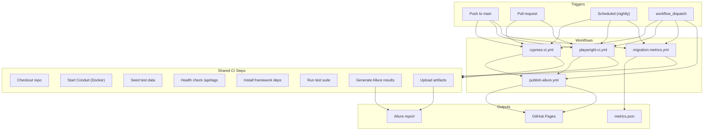
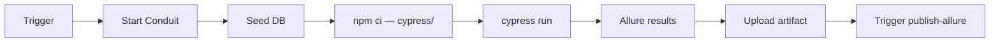
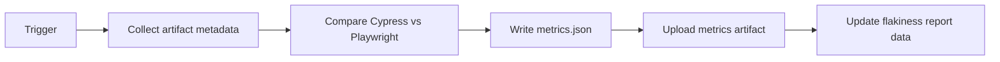
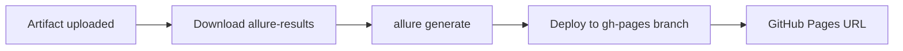

# CI/CD Flow

> Mermaid diagrams — no PNG assets.

## Pipeline Overview

Four GitHub Actions workflows orchestrate the migration initiative. Each workflow starts Conduit locally, runs tests, generates Allure results, uploads artifacts, and contributes to the GitHub Pages dashboard.

## Cypress CI Pipeline

## Playwright CI Pipeline

```mermaid
flowchart LR
    A[Trigger] --> B[Start Conduit]
    B --> C[Seed DB]
    C --> D[npm ci — playwright/]
    D --> E[playwright install browsers]
    E --> F[setup project: auth.setup.ts]
    F --> G[playwright test]
    G --> H[Allure results]
    H --> I[Upload artifact]
    I --> J[Trigger publish-allure]
```

## Migration Metrics Pipeline

## Allure Publish Pipeline

## Artifact Matrix

| Artifact | Source workflow | Retention | Status |
|----------|----------------|-----------|--------|
| `cypress-allure-results` | cypress-ci.yml | 30 days | TODO: CI validate |
| `playwright-allure-results` | playwright-ci.yml | 30 days | TODO: CI validate |
| `migration-metrics` | migration-metrics.yml | 90 days | TODO |
| Local baseline JSON | `npm run baseline:*` | Committed summaries | ✅ 2026-06-22 |

## Measured Local Baseline (reference)

| Framework | Avg duration | Pass rate (10 runs) | Flaky specs |
|-----------|--------------|---------------------|-------------|
| Cypress | 28.7s | 100% | none |
| Playwright | 7.3s | 100% | none |

Source: `migration/baseline/comparison-matrix.md`

## Environment Variables (CI)

| Variable | Source | Purpose |
|----------|--------|---------|
| `CONDUIT_BASE_URL` | Workflow env | App URL (localhost:3000) |
| `CONDUIT_API_URL` | Workflow env | API base URL |
| `TEST_USER_EMAIL` | GitHub Secrets | Auth credentials |
| `TEST_USER_PASSWORD` | GitHub Secrets | Auth credentials |

## Related Documents

- [ADR-004: CI and Reporting](../adr/004-ci-and-reporting.md)
- [ADR-005: Environment — Local vs Hosted Conduit](../adr/005-environment-local-vs-hosted-conduit.md)
- [Flakiness Report](../analysis/flakiness-reliability-report.md)
