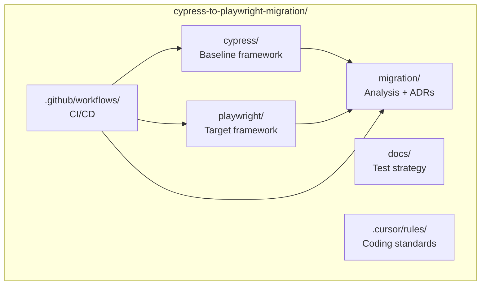
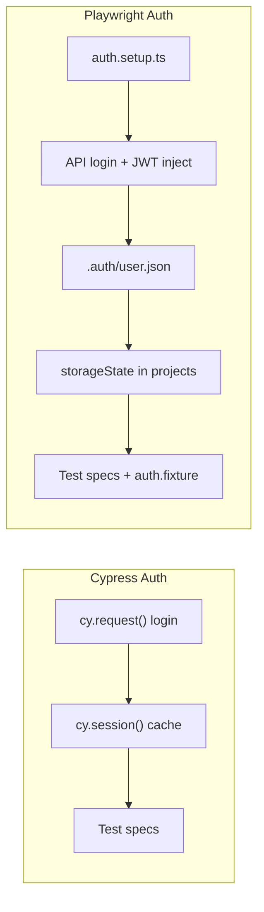
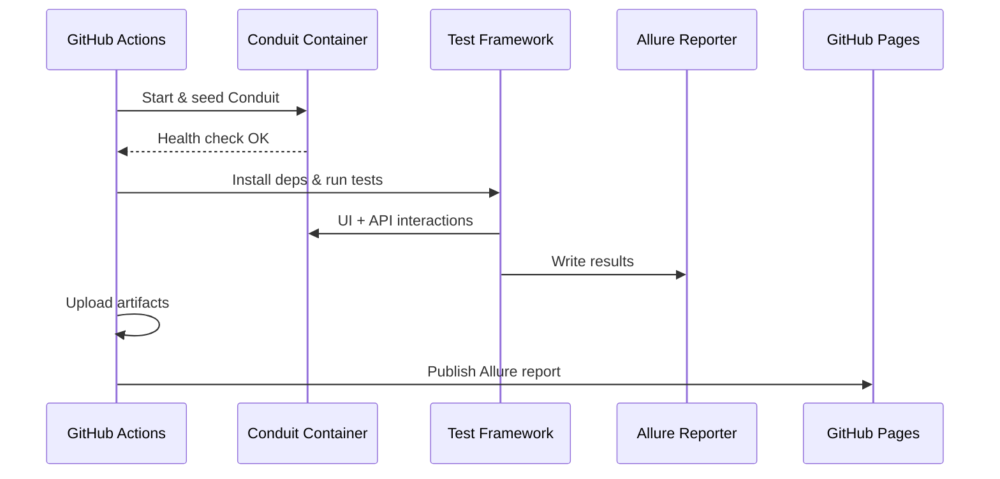

# Migration Architecture

> Mermaid diagrams — no PNG assets. Render in GitHub, VS Code, or any Mermaid-capable viewer.

## System Context

The migration repo runs two parallel test frameworks against a **locally hosted** RealWorld (Conduit) instance. No dependency on public demo endpoints — reproducibility and CI determinism are non-negotiable.

```mermaid
C4Context
    title Migration Monorepo — System Context

    Person(qe, "QE Engineer", "Authors & maintains tests")
    Person(dev, "Developer", "Consumes CI signals")

    System_Boundary(mono, "cypress-to-playwright-migration") {
        System(cypress, "Cypress Framework", "Baseline E2E suite")
        System(playwright, "Playwright Framework", "Target E2E suite")
        System(migration, "Migration Analysis", "ADRs, metrics, reports")
        System(ci, "GitHub Actions CI", "Orchestrates runs & reporting")
    }

    System_Ext(conduit, "Conduit (RealWorld)", "App under test — Docker/local")
    System_Ext(allure, "Allure Reports", "GitHub Pages dashboard")
    System_Ext(gh, "GitHub", "Source control & artifacts")

    Rel(qe, cypress, "Writes tests")
    Rel(qe, playwright, "Ports tests")
    Rel(qe, migration, "Documents decisions")
    Rel(cypress, conduit, "UI + API tests")
    Rel(playwright, conduit, "UI + API tests")
    Rel(ci, cypress, "Runs on push/schedule")
    Rel(ci, playwright, "Runs on push/schedule")
    Rel(ci, allure, "Publishes reports")
    Rel(dev, allure, "Reviews trends")
    Rel(mono, gh, "Hosted in")
```

## Monorepo Layout



## Auth Architecture Comparison



## Data Flow — Test Execution



## Design Principles

| Principle | Rationale |
|-----------|-----------|
| Local Conduit only | Eliminates external demo flakiness (ADR-005) |
| Dual-run during migration | Empirical comparison requires both frameworks live |
| Auth setup isolated | Fast, deterministic suites (ADR-001) |
| POM everywhere | Maintainability at scale (ADR-002) |
| Role-based selectors | Resilience on third-party UI (ADR-003) |
| Allure as single reporting layer | Comparable dashboards across frameworks (ADR-004) |

## Related Documents

- [CI/CD Flow](./ci-cd-flow.md)
- [Test Pyramid](./test-pyramid.md)
- [Auth Flow Comparison](../analysis/auth-flow-comparison.md)
