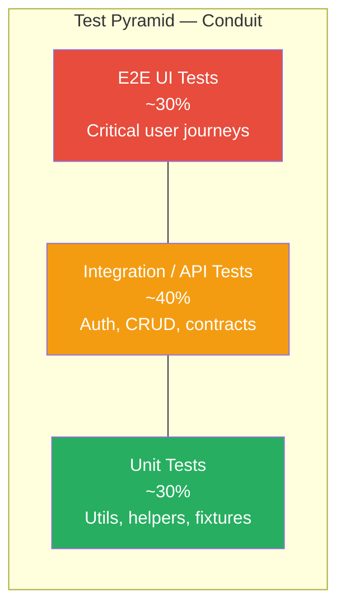
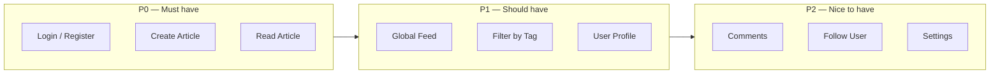

# Test Pyramid — Conduit Migration

> Mermaid diagrams — no PNG assets.

## Target Pyramid

For the RealWorld (Conduit) migration, we optimize for **confidence per minute of CI time**. The pyramid below reflects the intended steady-state distribution after migration completes.

## Layer Definitions

| Layer | Scope | Framework | Examples (Conduit) |
|-------|-------|-----------|-------------------|
| E2E UI | Full browser, real app | Playwright (target) | Login → create article → verify in feed |
| Integration / API | HTTP against Conduit API | Playwright `request` / Cypress `cy.request()` | POST login, GET/POST articles, follow user |
| Unit | Pure functions, no browser | Vitest/Jest (future) | Slug generator, API response parsers, fixture builders |

## Current vs Target Distribution

| Layer | Cypress (current) | Playwright (target) | Notes |
|-------|-------------------|---------------------|-------|
| E2E UI | _TBD %_ | _TBD %_ | Port existing UI specs |
| API / Integration | _TBD %_ | _TBD %_ | Expand API coverage during migration |
| Unit | 0% | _TBD %_ | Add for shared utils |

## Conduit Journey Mapping

## Test Type Selection Guide

| Scenario | Recommended layer | Rationale |
|----------|-------------------|-----------|
| JWT acquisition | API | Fast, no browser overhead |
| Form validation messages | E2E UI | Requires DOM rendering |
| Article CRUD contract | API | Validates backend directly |
| Navigation / routing | E2E UI | Browser history, URL assertions |
| Pagination logic | API + E2E | API for data, E2E for UI rendering |
| Auth session reuse | Setup project / cy.session | Not a test — infrastructure |

## Anti-patterns to Avoid

| Anti-pattern | Why | Alternative |
|--------------|-----|-------------|
| E2E for every API endpoint | Slow, brittle | API integration tests |
| UI login in every spec | Wastes CI time | storageState / cy.session() |
| CSS class selectors on Conduit | Third-party DOM changes | getByRole, getByLabel |
| Testing Conduit internals | We don't control the app | Test observable behavior only |

## Related Documents

- [Test Strategy](../../docs/test-strategy.md)
- [ADR-002: Why POM](../adr/002-why-pom.md)
- [ADR-003: Selector Strategy](../adr/003-selector-strategy.md)
- [Migration Analysis](../analysis/migration-analysis.md)
