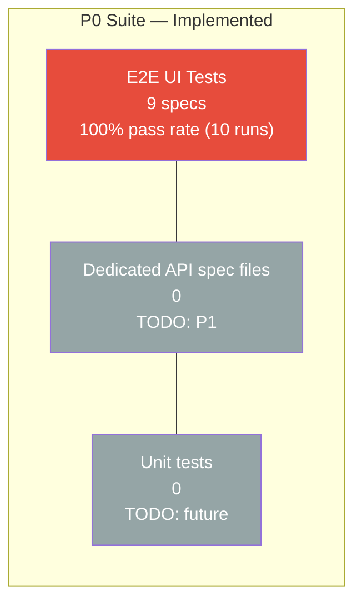
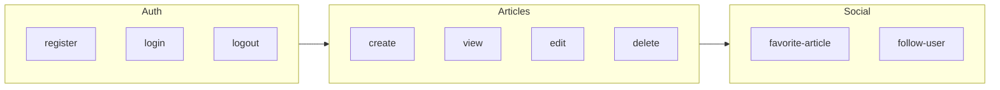

# Test Pyramid — Conduit Migration

> Mermaid diagrams — no PNG assets.  
> **P0 measured:** 9 E2E UI specs, 100% pass rate (10 local runs each framework).

## Current State (P0 — measured)

## Target Pyramid (steady state — percentages TODO)

## Layer Definitions

| Layer | Scope | Framework | P0 status |
|-------|-------|-----------|-----------|
| E2E UI | Full browser, real app | Cypress + Playwright | **9 specs — both 100% pass (10 runs)** |
| Integration / API | HTTP against Conduit API | `apiClient` helpers in specs | Used in setup, not standalone spec files |
| Unit | Pure functions | TODO: Vitest/Jest | `userFactory`, `articleFactory` only |

## P0 Journey Map (implemented)

| Spec | Cypress pass (10 runs) | Playwright pass (10 runs) | Flaky |
|------|------------------------|---------------------------|-------|
| register | 100% | 100% | no |
| login | 100% | 100% | no |
| logout | 100% | 100% | no |
| create-article | 100% | 100% | no |
| view-article | 100% | 100% | no |
| edit-article | 100% | 100% | no |
| delete-article | 100% | 100% | no |
| favorite-article | 100% | 100% | no |
| follow-user | 100% | 100% | no |

## Test Type Selection Guide

| Scenario | Layer used in P0 | Framework mechanism |
|----------|------------------|---------------------|
| JWT acquisition | API helper | `apiClient` + `cy.session()` / `injectConduitAuth` |
| Register / login UI | E2E UI | RegisterPage, LoginPage |
| Article CRUD journey | E2E UI + API setup | API create + UI assert |
| Auth session reuse | Infrastructure | `cy.session()` / `storageState` + fixture |
| Favorite / follow | E2E UI + API setup | Two users via API |

## Anti-patterns avoided in P0

| Anti-pattern | Status |
|--------------|--------|
| UI login in every authenticated spec | Avoided — session/storageState/fixture |
| `waitForTimeout` / fixed sleeps | **0 occurrences** in `playwright/` |
| Hardcoded credentials/URLs | Env-based config (`.env`) |
| Public demo dependency | Local Docker only (ADR-005) |

## Related Documents

- [Test Strategy](../../docs/test-strategy.md)
- [Comparison Matrix](../baseline/comparison-matrix.md)
- [ADR-002: Why POM](../adr/002-why-pom.md)
